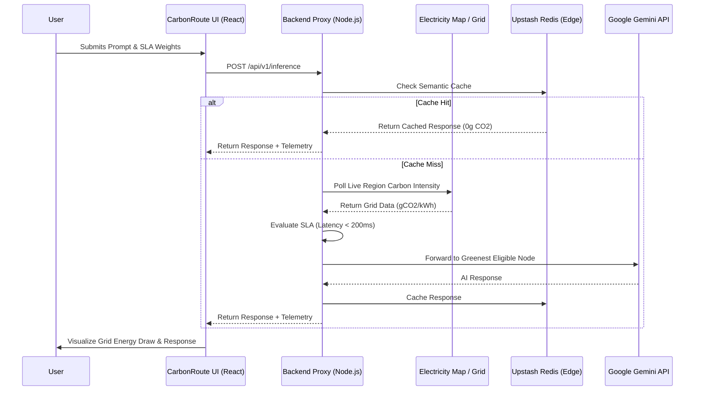

<div align="center">

# 🌱 CarbonRoute
### Sustainable Inference Routing Dashboard

<a href="https://carbon-route-alpha.vercel.app">
  
</a>
<a href="https://github.com/dheerajeshwar32/CarbonRoute">
  
</a>
<a href="https://github.com/dheerajeshwar32/carbonroute-api">
  
</a>

An intelligent, carbon-aware LLM inference dashboard. CarbonRoute dynamically routes AI requests to global regions based on live carbon intensity, strict latency SLAs, and compute cost weights. 

*(This repository contains the **React Client**)*

</div>

---

## ⚡ Live Demo

*(Replace `public/demo.gif` with a screen recording of the app in action!)*

## 🧠 System Architecture

The frontend communicates with the `carbonroute-api` proxy to achieve geographically-aware, sustainable inference routing.



## ✨ Key Features

*   **SLA Weight Sliders:** Dynamically balance Priority between **Cost** and **Carbon Footprint** via an interactive UI slider, automatically evaluating against a strict `< 200ms` latency SLA.
*   **Live Grid Telemetry:** Instantly visualize the routing decision, including the selected global region, network latency, and the live grid carbon intensity (`gCO2/kWh`).
*   **Zero-Emission Cache Indicators:** Automatically detects when a semantic cache hit occurs at the Edge (Redis), resulting in a **0g CO2 execution** highlight.
*   **Premium Dark UI:** Designed with a sleek, glassmorphic dark slate grid aesthetic ensuring maximum accessibility and a modern developer experience.

## 🛠️ Tech Stack

*   **Framework:** React (Vite)
*   **Styling:** Custom CSS with Glassmorphism & Grid Backgrounds
*   **Hosting:** Vercel

---

## 🚀 Local Setup Instructions

Follow these steps to run the CarbonRoute UI locally on your machine.

### Prerequisites
*   Node.js (v18 or higher)
*   The [carbonroute-api](https://github.com/dheerajeshwar32/carbonroute-api) backend running locally (or deployed in the cloud).

### 1. Clone the repository
```bash
git clone https://github.com/dheerajeshwar32/CarbonRoute.git
cd CarbonRoute
```

### 2. Install dependencies
```bash
npm install
```

### 3. Environment Variables
Create a `.env` file in the root directory to point to your backend API. If you are running the backend locally on port 10000:
```env
VITE_API_BASE_URL=http://localhost:10000/api/v1/inference
```

### 4. Start the Development Server
```bash
npm run dev
```
The application will launch and be accessible at `http://localhost:5173`.

---
<div align="center">
<i>Engineered by Nagula Dheeraj Eshwar Prudhvi</i>
</div>
